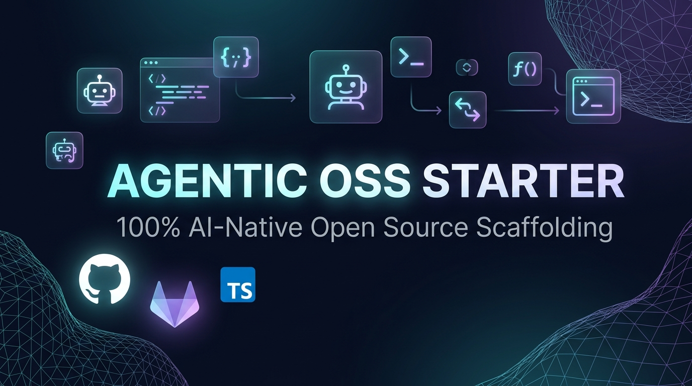

<div align="center">

# Agentic OSS Starter 🚀

**Production-ready GitHub Template Repository for 100% AI-Native Open-Source Monorepos with Nx**

<p align="center">
  <a href="https://github.com/shailesh17/agentic-oss-starter/actions/workflows/ci.yml">
    
  </a>
  <a href="https://gitlab.com/shaileshpatel17/agentic-oss-starter/-/pipelines">
    
  </a>
  <a href="https://github.com/shailesh17/agentic-oss-starter/blob/main/LICENSE">
    
  </a>
  <a href="https://nodejs.org">
    
  </a>
  <a href="https://pnpm.io">
    
  </a>
  <a href="https://nx.dev">
    
  </a>
  <a href="https://trunk.io">
    
  </a>
  <a href="https://www.conventionalcommits.org">
    
  </a>
</p>

<p align="center">
  
</p>

<p align="center">
  <a href="#-quick-start-in-10-seconds">Quick Start</a> •
  <a href="#-why-agentic-oss-starter">Why Agentic OSS?</a> •
  <a href="#-nx-monorepo--multi-tier-architecture">Nx Monorepo</a> •
  <a href="#-features--capabilities">Features</a> •
  <a href="#-ai-native-pairing-workflow">AI Pairing</a> •
  <a href="#-gitlab-dual-presence--gpg-mirroring">GitLab Mirror</a> •
  <a href="#-contributing">Contributing</a>
</p>

</div>

---

## 💡 Why Agentic OSS Starter?

Software development has fundamentally shifted to **AI-native pair-programming**. AI agents ([Antigravity](https://github.com/shailesh17/mcp-httpserver-proxy), [Cursor](https://www.cursor.com/), [Claude Code](https://claude.ai/), [GitHub Copilot](https://github.com/features/copilot)) write code, run tests, and open Pull Requests.

However, setting up a modern, multi-tier full-stack monorepo with production-grade engineering standards typically requires **hours of repetitive configuration**:

- Structuring multi-tier `apps/` and shared `packages/` with fast workspace symlinking.
- Configuring local task orchestration with smart computation caching and dependency graphs.
- Writing CI/CD matrix workflows across multiple Node versions.
- Enforcing Conventional Commits, semantic PR validation, and branch protection rules.
- Establishing agent prompt runbooks and automated rich PR templates.

**`agentic-oss-starter` provides all of this out-of-the-box in under 10 seconds.**

---

## ⚡ Quick Start in 10 Seconds

### Step 1: Initialize Your New Repository from this Template

```bash
# Create and clone a new repository using this template
gh repo create my-awesome-project --template shailesh17/agentic-oss-starter --public --clone
cd my-awesome-project
```

### Step 2: Apply Opinionated GitHub Standards & Branch Rulesets

```bash
# Enforces squash-and-merge, PR title defaults, signed commits, linear history, and CI status checks
./scripts/setup-github-repo.sh
```

### Step 3: (Optional) Mirror to GitLab with Verified GPG Commits

```bash
# Syncs your new repository to GitLab for dual-presence with automated GPG signing
./scripts/mirror-to-gitlab.sh
```

---

## 🏗️ Nx Monorepo & Multi-Tier Architecture

This template utilizes **pnpm workspaces** combined with **local Nx task orchestration** (with Nx Cloud telemetry explicitly disabled for 100% privacy and zero external dependencies).

```text
agentic-oss-starter/
├── apps/
│   ├── web/                    # Frontend Application (e.g. React / Vite / Next.js)
│   │   ├── package.json        # Name: @agentic/web
│   │   ├── tsconfig.json
│   │   ├── src/index.ts
│   │   └── test/web.test.ts
│   └── api/                    # Backend Service (e.g. Node / Express / MCP Server / Fastify)
│       ├── package.json        # Name: @agentic/api
│       ├── tsconfig.json
│       ├── src/index.ts
│       └── test/api.test.ts
├── packages/
│   └── shared/                 # Shared Library / Contracts / Types / Utilities
│       ├── package.json        # Name: @agentic/shared
│       ├── tsconfig.json
│       ├── src/index.ts
│       └── test/shared.test.ts
├── .agents/
│   └── skills/
│       └── create-pr/SKILL.md  # Automated rich AI PR workflow
├── .github/
│   ├── workflows/
│   │   ├── ci.yml              # Matrix testing (Node 22/24) with pnpm & Trunk
│   │   ├── semantic-pr.yml     # Conventional Commits PR title linter
│   │   └── release.yml         # Automated release notes drafter
│   ├── PULL_REQUEST_TEMPLATE.md
│   ├── copilot-instructions.md
│   └── dependabot.yml          # Consolidated weekly dependency updates
├── .gitlab-ci.yml              # GitLab CI pipeline for dual GitHub/GitLab presence
├── .trunk/                     # Multi-tier linting & formatting (Prettier, Actionlint, Markdownlint)
├── assets/                     # Social preview & branding assets
├── scripts/
│   ├── setup-github-repo.sh    # One-command GitHub settings & branch ruleset setup
│   └── mirror-to-gitlab.sh     # One-command GitLab mirror with GPG signature preservation
├── nx.json                     # Local Nx workspace task graph & cache config
├── pnpm-workspace.yaml         # Defines packages: ['apps/*', 'packages/*']
├── package.json                # Root package.json with unified orchestration scripts
├── tsconfig.json               # Base TypeScript compiler options
├── AGENTS.md & GEMINI.md       # AI agent pairing guidelines
├── CONTRIBUTING.md             # Contributor guide
├── LICENSE                     # MIT License
└── README.md                   # Complete documentation
```

---

## 🎯 Standard "Common Build Language" for AI Agents

Every app and package inside `apps/*` and `packages/*` adheres to the same standard command contract in its local `package.json`:

| Target               | Command                   | Behavior                                                                      |
| :------------------- | :------------------------ | :---------------------------------------------------------------------------- |
| **`build`**          | `pnpm run build`          | Builds all packages in topological dependency order (`^build`). Cached by Nx. |
| **`test`**           | `pnpm test`               | Runs native Node 22 test suites across all packages and apps. Cached by Nx.   |
| **`dev`**            | `pnpm run dev`            | Runs watch mode across all packages simultaneously.                           |
| **`lint`**           | `pnpm run check`          | Lints all files across all tiers using local Trunk suite.                     |
| **`format`**         | `pnpm run format`         | Auto-formats all workspace files using Prettier via Trunk.                    |
| **`affected:test`**  | `pnpm run affected:test`  | Runs tests **only** for packages affected by the current Git branch changes.  |
| **`affected:build`** | `pnpm run affected:build` | Compiles **only** packages affected by the current Git branch changes.        |

---

## ➕ Adding a New App or Package

### 1. Adding a New Application (e.g. `apps/worker` or `apps/docs`)

1. Create a folder `apps/my-app/` with a `package.json`:
   ```json
   {
     "name": "@agentic/my-app",
     "version": "0.1.0",
     "type": "module",
     "scripts": {
       "build": "tsc",
       "test": "node --test test/**/*.test.ts",
       "dev": "tsc -w"
     },
     "dependencies": {
       "@agentic/shared": "workspace:*"
     }
   }
   ```
2. Run `pnpm install`.
3. Nx automatically discovers the new project and integrates it into `pnpm run build` and `pnpm test`!

### 2. Adding a Polyglot Tier (e.g. Python Backend / FastAPI / MCP)

You can include non-Node services (e.g., Python with `uv` or Go) by adding a `package.json` with standard script hooks:

```json
{
  "name": "@agentic/python-service",
  "scripts": {
    "build": "echo 'Building Python service...'",
    "test": "pytest",
    "dev": "uvicorn main:app --reload"
  }
}
```

---

## 📦 Features & Capabilities

| Feature                         | Description                                                                       | File / Tool                                                 |
| :------------------------------ | :-------------------------------------------------------------------------------- | :---------------------------------------------------------- |
| **⚡ Local Nx Monorepo**        | Task caching, topological builds, and affected commands with zero cloud telemetry | `nx.json`, `pnpm-workspace.yaml`                            |
| **🤖 AI Agent Guidelines**      | Comprehensive pairing rules, stdout stream hygiene, and prompt runbooks           | `AGENTS.md`, `GEMINI.md`, `.github/copilot-instructions.md` |
| **⚡ AI PR Creation Skill**     | Automated rich Markdown PR generator with verification & checklist                | `.agents/skills/create-pr/SKILL.md`                         |
| **🧪 Multi-Node Matrix CI**     | Automated builds & tests across Node 22.x & 24.x with pnpm cache                  | `.github/workflows/ci.yml`                                  |
| **📝 Semantic PR Validation**   | Enforces Conventional Commits specification on PR titles                          | `.github/workflows/semantic-pr.yml`                         |
| **🏷️ Release Drafter**          | Automatically drafts release notes categorized by Conventional Commits            | `.github/workflows/release.yml`                             |
| **🦊 GitLab CI/CD Pipeline**    | Dual-platform CI pipeline ready for GitLab mirroring with zero config             | `.gitlab-ci.yml`, `scripts/mirror-to-gitlab.sh`             |
| **🔐 GPG Mirror Verification**  | Automatically signs mirrored commits with personal GPG keys on GitLab             | `scripts/mirror-to-gitlab.sh`                               |
| **🛡️ Automated Repo Rules**     | One-command setup for squash merging, linear history, and branch rulesets         | `scripts/setup-github-repo.sh`                              |
| **🧹 Zero Global Dependencies** | Trunk launcher, TypeScript, Nx, and Commitlint run locally via `node_modules`     | `.trunk/trunk.yaml`, `package.json`                         |
| **🤖 Consolidated Dependabot**  | Groups weekly updates into unified PRs, preventing rebasing cascades              | `.github/dependabot.yml`                                    |

---

## 🤖 AI-Native Pairing Workflow

This template is configured to instruct AI agents how to contribute safely and effectively across all workspace tiers.

### 📚 Agent Configuration Files

| File                                  | Target Agent / IDE         | Purpose                                                        |
| :------------------------------------ | :------------------------- | :------------------------------------------------------------- |
| **`AGENTS.md`**                       | All Coding Agents          | Monorepo architecture, common build language, and PR workflow. |
| **`GEMINI.md`**                       | Antigravity / Gemini IDE   | Workspace instructions and automated PR standards.             |
| **`.github/copilot-instructions.md`** | GitHub Copilot & Cursor    | Coding conventions, monorepo guidelines, and tooling commands. |
| **`.agents/skills/create-pr/`**       | Antigravity / AI Subagents | Automated PR creation runbook & rich Markdown generator.       |

### 💬 Ready-to-Use Agent Prompt

Copy and paste this prompt when instructing your AI assistant:

```text
Please implement [feature/fix description].
1. Follow the monorepo guidelines in AGENTS.md.
2. Verify with `pnpm run build`, `pnpm test`, `pnpm run format`, and `pnpm run check`.
3. Open a Pull Request using the workflow in `.agents/skills/create-pr/SKILL.md`.
```

---

## 🦊 GitLab Dual-Presence & GPG Mirroring

Maintain an active presence on both **GitHub** and **GitLab** with zero duplicate maintenance.

### One-Command Sync:

```bash
./scripts/mirror-to-gitlab.sh
```

**How it works:**

1. Ensures the project exists on your GitLab profile via `glab`.
2. Automatically signs the commit payload with your local GPG key (`git commit-tree`).
3. Pushes `main` and all tags to GitLab with force-update permissions for perfect mirror fidelity.
4. Triggers the GitLab CI pipeline (`.gitlab-ci.yml`).
5. Commits display the green **"Verified"** badge on GitLab!

---

## 🛡️ Repository Standards & Rulesets

Running `./scripts/setup-github-repo.sh` applies GitHub standards via GitHub CLI:

- **Squash-and-Merge Enforcement**: Disables merge commits and rebase merges to maintain a clean linear Git history.
- **Clean Commit Titles**: Sets default squash commit title to the PR Title and body to commit details.
- **Modern Branch Ruleset (`main`)**:
  - Direct pushes to `main` restricted (Pull Requests required).
  - Force pushes and branch deletions blocked.
  - Linear history required.
  - Signed commits required (GPG / SSH verified).
  - Required CI status checks: Node 22 Build & Test, Node 24 Build & Test, Trunk Lint, Semantic PR Title.

---

## 📝 Conventional Commits Specification

All commit messages and Pull Request titles follow standard [Conventional Commits](https://www.conventionalcommits.org/):

`<type>(<optional scope>): <description>`

| Type       | Description                                                 | Example                                    |
| :--------- | :---------------------------------------------------------- | :----------------------------------------- |
| `feat`     | A new feature or capability                                 | `feat(api): add auth middleware`           |
| `fix`      | A bug fix                                                   | `fix(web): correct state initialization`   |
| `docs`     | Documentation changes only                                  | `docs(readme): add monorepo guide`         |
| `style`    | Formatting, missing semicolons, etc.                        | `style: format imports with Prettier`      |
| `refactor` | Code restructuring without fixing a bug or adding a feature | `refactor(shared): extract string utility` |
| `perf`     | Performance improvements                                    | `perf(nx): optimize cache outputs`         |
| `test`     | Adding or updating tests                                    | `test(api): add e2e route tests`           |
| `build`    | Build system or dependency updates                          | `build: bump typescript to 5.7.2`          |
| `ci`       | CI configuration files or scripts                           | `ci: add matrix test for Node 24`          |
| `chore`    | Routine maintenance tasks                                   | `chore(trunk): sync linter configs`        |
| `revert`   | Reverting a previous commit                                 | `revert: undo experimental cache`          |

---

## 📄 License

This project is licensed under the [MIT License](./LICENSE).
